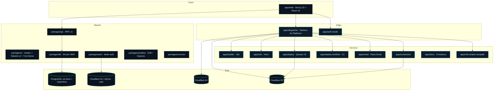
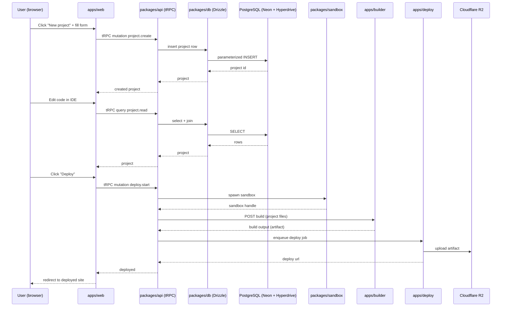
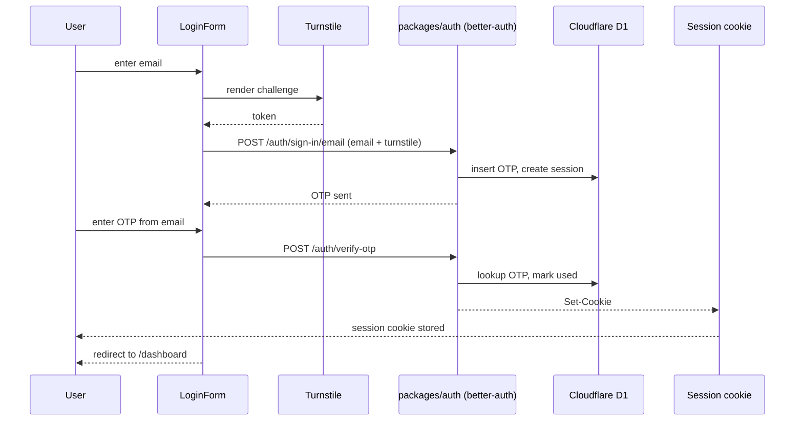
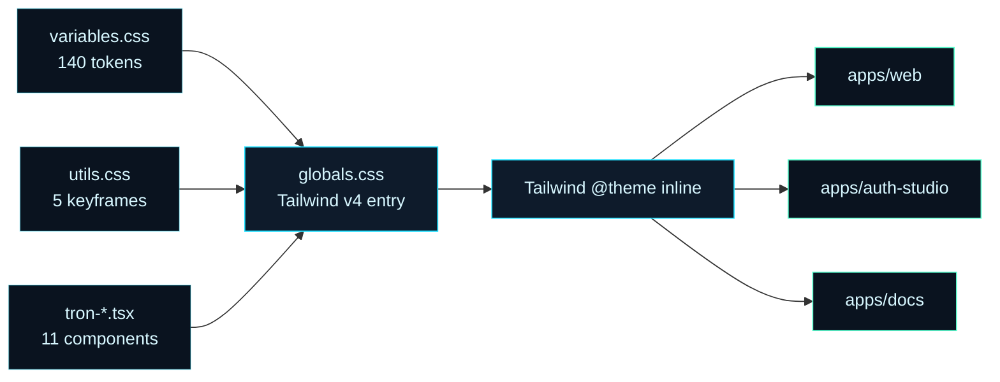

# 02 — Architecture

> Libra is an AI-powered web development platform built as a Turborepo monorepo targeting Cloudflare Workers. The system composes 12 services, 13 shared packages, and a dual-database layer (PostgreSQL for business data, D1 for auth).

## High-level system



## Module map

### Apps (`apps/`)

| App | Purpose | Stack |
|---|---|---|
| `web` | Main product UI, marketing, dashboard, IDE | Next.js 15, React 19, Tailwind v4, shadcn |
| `builder` | Vite build service for user projects | Vite, Bun |
| `cdn` | Asset CDN | Hono, Cloudflare Workers |
| `deploy` | Deployment service V2 (event-driven) | Hono, Cloudflare Queues |
| `deploy-workflow` | Deployment service V1 (orchestrated) | Hono, Cloudflare Workflows |
| `dispatcher` | Request routing into user subdomains | Hono, Workers for Platforms |
| `auth-studio` | Auth management console | Next.js |
| `docs` | Documentation site | Next.js + FumaDocs |
| `email` | Email service (templates + transport) | React Email, Resend |
| `screenshot` | Screenshot rendering for previews | Playwright on Cloudflare |
| `vite-shadcn-template` | Project template engine | Vite + shadcn |

### Packages (`packages/`)

| Package | Purpose |
|---|---|
| `ui` | Design system: shadcn + Tailwind v4 + Tron theme tokens + Tron components |
| `api` | tRPC 11 routers consumed by `web` |
| `auth` | `better-auth` configuration (email + GitHub OAuth + Turnstile) |
| `better-auth-cloudflare` | Cloudflare adapter for `better-auth` |
| `better-auth-stripe` | Stripe integration for `better-auth` (subscriptions, billing portal) |
| `common` | Shared utilities, types, constants |
| `db` | Drizzle ORM schemas, migrations, connection management |
| `email` | React Email templates + transport |
| `middleware` | Shared middleware (rate limit, CORS, auth gates) |
| `sandbox` | E2B / Daytona abstraction for safe code execution |
| `shikicode` | Code editor with syntax highlighting (Shiki) |
| `templates` | Project scaffolding templates |
| `ui` | Design system primitives |

## Data flow — user creates a project



## Data flow — login



## Routing

`apps/web` uses Next.js 15 App Router with route groups:

```
app/
  (frontend)/
    layout.tsx                       # root layout, providers
    (marketing)/
      page.tsx                       # landing
    (auth)/
      login/page.tsx
      signup/page.tsx
    (dashboard)/
      dashboard/
        layout.tsx                   # auth gate + sidebar
        page.tsx                     # dashboard home
        admin/page.tsx
        billing/page.tsx
        integrations/page.tsx
        session/loading.tsx
        session/page.tsx
        teams/page.tsx
      project/[id]/
        layout.tsx                   # ProjectProvider
        page.tsx
```

`apps/web/app/layout.tsx` is the single entry point that imports the Tron design tokens via Tailwind v4 `@source` directive on `packages/ui/src/**/*`.

## Theming pipeline (Tron)



## Database

- **PostgreSQL (business data)** — projects, sessions (app), billing, teams, integrations. Access via Drizzle ORM through Hyperdrive connection pool.
- **D1 SQLite (auth data)** — users, OAuth accounts, OTP codes, sessions (auth). Accessed via `better-auth-cloudflare` adapter.

See `05-DATABASE.md` for full schema.

## Cloudflare services

- **Workers** — primary compute for every service
- **Durable Objects** — coordinator state (dispatcher, deploy queue)
- **D1** — auth SQLite
- **KV** — session cache, rate-limit counters, Turnstile state
- **R2** — user build artifacts, screenshots
- **Queues** — async deploy pipeline
- **Workflows** — long-running deploy orchestration
- **Workers for Platforms** — multi-tenant user project hosting via dispatcher

## Security model

- All traffic over HTTPS, HSTS preloaded
- Turnstile challenge on every auth flow
- Rate limit on auth, signup, deploy endpoints (KV-backed counters)
- All secrets in `wrangler secret` or `process.env`, never in source
- Parameterized queries via Drizzle (no string concatenation)
- Content Security Policy headers on every response
- CSRF protection on state-changing requests

## Build & deploy

See `07-HOW-TO-RUN.md` for local dev. See `01-IMPLEMENTATION-PLAN.md` Phase 5–8 for production deploy plan (blocked on CLOUDFLARE_* credentials).
