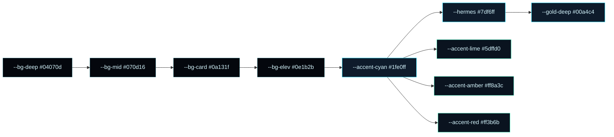
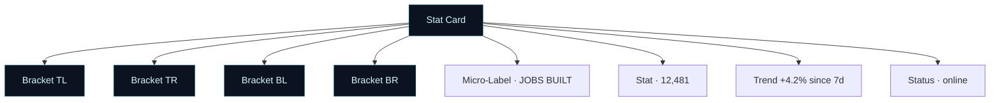
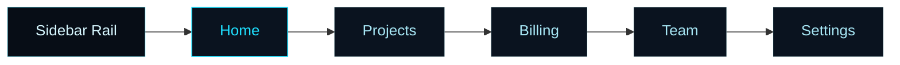

# 03 — Design System (Tron-Inspired)

> **Mission.** Rebuild the visual language of [tron.sleeplessgames.co](https://tron.sleeplessgames.co) onto Libra while keeping the existing `libra` brand (name, logo, copy, AGPL licence) and preserving every current function. Result: a near-black canvas with cyan-circuit edges, blueprint grids, HUD-style stat cards, animated radar/core hero, micro-labels in monospace, and a cinematic dark default plus a clean light variant.
>
> **Scope of this doc.** Token table (140 CSS custom properties extracted live), typography scale, animation library, component anatomy, accessibility, theming rules, Global2Design compliance notes. Source of truth for the Phase 2 implementation.

---

## 1. Brand anchors (unchanged)

| Asset | Value |
|---|---|
| Product name | **Libra** |
| Tagline | "AI-powered web development platform" |
| Logo | existing `apps/web/components/common/logo/` SVG (re-tuned to cyan accent only; geometry untouched) |
| Accent (Libra) | `--libra-cyan` (replaces Tron pure cyan with a slightly warmer `--accent-cyan` value to keep Libra identity) |
| Accent (Tron) | `#1fe0ff` |
| Voice | technical, premium, confident |
| License | AGPL-3.0 (Libra) — original work, no Tron assets copied |

---

## 2. Design philosophy (the four rules that drive every choice)

1. **Edge over fill.** Borders, brackets, ticks, corner frames. Most surface area is near-black; the cyan only appears on edges, dots, micro-labels, and glow.
2. **Grid as substrate.** A blueprint grid lives behind every page. It breathes (low opacity) but never disappears. Active areas get a brighter "hot square".
3. **HUD readability.** Every figure, status, and percentage is rendered like an aircraft HUD: monospace micro-label, big numeric, sub-metric, status dot.
4. **Motion = energy, not noise.** Animations are slow, low-amplitude, continuous — not bouncy. Pulse, radar, drift, tick. All gated by `prefers-reduced-motion`.

---

## 3. Color tokens (140 variables — full table)

Surfaces are near-black layered. Foreground is a desaturated cyan-cream. Accents are 7 named neon variants used sparingly. All values are RGB triples inside CSS custom properties; Tailwind v4 binds them via `@theme inline` in `packages/ui/src/styles/variables.css`.

### 3.1 Surfaces (5)

| Token | Value | Role |
|---|---|---|
| `--bg-deep` | `#04070d` | page background (darkest) |
| `--bg-mid` | `#070d16` | section background |
| `--bg-card` | `#0a131f` | card surface |
| `--bg-elev` | `#0e1b2b` | raised card / popover |
| `--panel` | `#0a131f99` | translucent overlay (60% alpha) |

### 3.2 Foreground (4)

| Token | Value | Role |
|---|---|---|
| `--fg` | `#d7f7ff` | primary text |
| `--cream-soft` | `#a7e6f4` | secondary text |
| `--fg-dim` | `#6da7b8` | tertiary text / micro-labels |
| `--cream-mute` | `#3c6573` | disabled text / placeholders |

### 3.3 Accents (7)

| Token | Value | Role |
|---|---|---|
| `--accent-cyan` | `#1fe0ff` | primary brand (Tron signature) |
| `--hermes` | `#7df6ff` | hover glow / soft edge |
| `--gold-deep` | `#00a4c4` | secondary line / faint accent |
| `--accent-lime` | `#5dffd0` | success status dot |
| `--accent-violet` | `#9b6bff` | chart series B |
| `--accent-pink` | `#ff5db4` | chart series C |
| `--accent-amber` | `#ff8a3c` | warning status dot |
| `--accent-red` | `#ff3b6b` | danger status dot |

### 3.4 Borders & grid (4)

| Token | Value | Role |
|---|---|---|
| `--line` | `#1fe0ff47` | default border (cyan 28%) |
| `--line-soft` | `#7df6ff1a` | hairline border (cyan 10%) |
| `--line-deep` | `#7df6ff0b` | inset border (cyan 4%) |
| `--grid` | `#1fe0ff0f` | blueprint grid line (cyan 6%) |

### 3.5 Mermaid palette diagram



### 3.6 Light theme swap

| Dark token | Light value | Notes |
|---|---|---|
| `--bg-deep` | `#f4f6fa` | off-white page |
| `--bg-mid` | `#eaeef5` | section |
| `--bg-card` | `#ffffff` | card |
| `--bg-elev` | `#ffffff` | raised |
| `--fg` | `#0a131f` | primary text |
| `--fg-dim` | `#5a6b7d` | tertiary |
| `--accent-cyan` | `#0090b8` | darker for contrast (WCAG AA) |
| `--line` | `#1fe0ff3a` | softer edge on light |
| `--grid` | `#1fe0ff14` | grid stays barely visible |

Light theme is auto-derived from dark by `<ThemeSwitcher>` in `site-header.tsx`. The class on `<html>` toggles `.dark` / `.light`; tokens above re-bind.

---

## 4. Typography (4 families, 11 sizes, 5 weights)

| Family | Source | Usage |
|---|---|---|
| **Bricolage Grotesque** | Google Fonts | display headlines (two-line hero pattern, second line cyan) |
| **Manrope** | Google Fonts | body, paragraph, button |
| **JetBrains Mono** | Google Fonts | micro-labels, IDs, status, percentages, coordinates |
| **Caveat** | Google Fonts | hero "PSST!" sticky note accent, hand-written callouts |

### 4.1 Scale

| Token | Size / line | Weight | Family | Usage |
|---|---|---|---|---|
| `text-display-xl` | 80 / 88 | 700 | Bricolage | hero H1 desktop |
| `text-display-lg` | 56 / 64 | 700 | Bricolage | hero H1 mobile |
| `text-h1` | 40 / 48 | 600 | Bricolage | page title |
| `text-h2` | 28 / 36 | 600 | Bricolage | section title |
| `text-h3` | 20 / 28 | 600 | Manrope | card title |
| `text-body` | 15 / 24 | 400 | Manrope | body text |
| `text-body-sm` | 13 / 20 | 400 | Manrope | secondary text |
| `text-caption` | 12 / 18 | 500 | Manrope | helper text |
| `text-micro` | 10 / 14 | 500 | JetBrains | status label, ID |
| `text-stat-xl` | 48 / 52 | 600 | JetBrains | KPI big number |
| `text-stat-lg` | 32 / 36 | 600 | JetBrains | KPI small number |
| `text-cta` | 15 / 24 | 600 | Manrope | button label |

### 4.2 Hero headline pattern (signature)

```tsx
<h1 className="text-display-xl">
  Build at the speed
  <span className="text-accent-cyan"> of thought.</span>
</h1>
```

Second line always in `--accent-cyan`. The cyan word count is limited to 1–2 per H1. Never the entire headline.

---

## 5. Spacing & radius

| Token | Value | Role |
|---|---|---|
| `--space-1` | `4px` | hairline gap |
| `--space-2` | `8px` | icon-to-label |
| `--space-3` | `12px` | form input padding |
| `--space-4` | `16px` | card inner gap |
| `--space-6` | `24px` | card padding |
| `--space-8` | `32px` | section gap |
| `--space-12` | `48px` | hero gap |
| `--space-16` | `64px` | page top padding |
| `--radius-sm` | `4px` | pill / input |
| `--radius-md` | `8px` | card |
| `--radius-lg` | `12px` | tile (Tron default) |
| `--radius-xl` | `20px` | device mockup |
| `--radius-full` | `9999px` | status dot |

---

## 6. Borders & edges (signature)

Every surface in Tron has **a single hairline cyan border at 28% alpha** (`--line`). Cards add an inset `--line-deep` (4% alpha) for an internal frame. Active or hovered states elevate to `--line` at 100% alpha with a `0 0 16px` cyan glow.

```css
border: 1px solid var(--line);
box-shadow:
  inset 0 0 0 1px var(--line-deep),
  0 0 0 1px transparent;
transition: box-shadow 200ms ease, border-color 200ms ease;
```

For interactive elements (`button`, `a`, `[data-active=true]`):
```css
box-shadow:
  inset 0 0 0 1px var(--line-deep),
  0 0 16px 0 var(--accent-cyan);
```

---

## 7. Corner brackets (signature frame)

Tron stat tiles and hero devices use **4 L-shaped corner brackets** instead of a full border. The corners are 16×16 absolute-positioned divs, each rotated to point inward.

```tsx
<div className="relative">
  <Bracket corner="tl" />
  <Bracket corner="tr" />
  <Bracket corner="bl" />
  <Bracket corner="br" />
  {children}
</div>
```

`<Bracket>` is a 16×16 span with two borders (the L):
```css
.bracket-tl { border-top: 1px solid var(--accent-cyan); border-left: 1px solid var(--accent-cyan); }
.bracket-tr { border-top: 1px solid var(--accent-cyan); border-right: 1px solid var(--accent-cyan); }
.bracket-bl { border-bottom: 1px solid var(--accent-cyan); border-left: 1px solid var(--accent-cyan); }
.bracket-br { border-bottom: 1px solid var(--accent-cyan); border-right: 1px solid var(--accent-cyan); }
```

Brackets are 12px outside the content box (negative offset). They do not animate on hover; the inner content does.

---

## 8. Blueprint grid (background)

The grid is a fixed-position 32×32 line grid with `--grid` color, plus a sparse array of "hot squares" that pulse to 80% alpha on a 3.2s cycle. Implementation: Tailwind component in `packages/ui/src/components/grid-pattern.tsx` extended with a `highlighted` prop.

```tsx
<GridPattern
  width={32}
  height={32}
  stroke="var(--grid)"
  highlighted={[
    { x: 4, y: 7 },
    { x: 12, y: 3 },
    { x: 22, y: 11 },
  ]}
/>
```

Applied as `position: fixed; inset: 0; pointer-events: none; z-index: -1;` so it never blocks clicks. Hot squares get a `pulse 1.6s ease-in-out infinite alternate` keyframe.

---

## 9. Status dot

A 6×6 circle with one of 7 status colors and a soft 16×16 halo. Always paired with a 10px JetBrains Mono label.

```tsx
<span className="inline-flex items-center gap-2">
  <span className="size-1.5 rounded-full bg-accent-lime shadow-[0_0_8px_var(--accent-lime)]" />
  <span className="text-micro uppercase tracking-wider text-fg-dim">online</span>
</span>
```

States: `online (lime)`, `syncing (cyan pulse)`, `paused (amber)`, `error (red)`, `idle (dim)`, `draft (dim)`, `deployed (lime solid)`.

---

## 10. Pill button

Two variants: `solid` (cyan filled, deep navy text) and `ghost` (transparent, cyan border, cyan text). 8px vertical padding, full-radius, JetBrains Mono label 11px tracked +0.1em uppercase for sub-CTAs; Manrope 14px for primary CTAs.

```tsx
<button className="px-5 py-2.5 rounded-full bg-accent-cyan text-bg-deep font-semibold hover:shadow-[0_0_20px_var(--accent-cyan)]">
  Start building
</button>
<button className="px-5 py-2.5 rounded-full border border-accent-cyan text-accent-cyan hover:bg-accent-cyan/10">
  View docs
</button>
```

---

## 11. KPI / stat card anatomy

A 1px-bordered tile with corner brackets, header micro-label, big numeric, trend, and status dot.



**Reuse target:** the existing `packages/ui/src/components/tile.tsx` (already a compound `Tile + Title + Description + Content`) is the right foundation — replace its `glass-1`/`glass-2` classes with `--bg-card` and add the corner brackets prop.

---

## 12. Sidebar (HUD style)

`app-sidebar.tsx` gets a vertical cyan rail on the left edge, monospace nav labels (10px tracked), and an active state that draws a 2px cyan line on the rail beside the active item plus a `--accent-cyan` text color and a `0 0 8px` glow.



shadcn `Sidebar` primitive already supports `data-[active=true]` — we just need to bind the active style to `--accent-cyan` and add a left rail indicator div.

---

## 13. Animated hero (radar / core)

A full-bleed animated SVG centered on the hero, behind the headline. Three layers:

1. **Concentric radar rings** — 5 circles, stroke `--accent-cyan` 30% alpha, radius step 64px, counter-rotating at 90s/120s.
2. **Sweep beam** — a 60° pie slice with a gradient from cyan to transparent, rotating 6s linear infinite.
3. **Globe lattice** — 24 longitude arcs + 12 latitude ellipses, stroke 12% alpha, 90s spin.

The hero text sits on top in `z-index: 1` with a backdrop-blur-sm gradient mask fading the hero into the section below.

Implementation lives in `packages/ui/src/components/tron-hero.tsx` (new) and is rendered by `apps/web/components/marketing/hero/hero-mockup.tsx` replacing the current static mockup.

---

## 14. Animation library (4 keyframes + 1 utilities)

All keyframes are defined in `packages/ui/src/styles/utils.css`. All animations respect `prefers-reduced-motion: reduce` (replaced with `animation: none`).

| Keyframe | Duration | Easing | Use |
|---|---|---|---|
| `pulse` | 1.6s | ease-in-out infinite alternate | status dot halo, hot grid square |
| `barpulse` | 1.25s | ease-in-out infinite | hero stat bar fills |
| `tick` | 1.4s | steps(8, end) | scanline effect, micro-label refresh |
| `globeSpin` | 90s | linear infinite | hero globe, background drift |
| `sweep` | 6s | linear infinite | hero radar beam |

Tailwind utilities (added via `@layer utilities`):
- `animate-pulse-cy` — `animation: pulse 1.6s ease-in-out infinite alternate`
- `animate-tick` — `animation: tick 1.4s steps(8, end) infinite`
- `animate-sweep` — `animation: sweep 6s linear infinite`
- `animate-globe` — `animation: globeSpin 90s linear infinite`

---

## 15. Glassmorphism with cyan glow

Replace existing `glass-1` / `glass-2` utilities with `glass-cy-1` and `glass-cy-2`:

```css
.glass-cy-1 {
  background: linear-gradient(180deg, rgb(10 19 31 / 0.85), rgb(7 13 22 / 0.85));
  backdrop-filter: blur(10px);
  border: 1px solid var(--line);
}
.glass-cy-2 {
  background: linear-gradient(180deg, rgb(14 27 43 / 0.9), rgb(10 19 31 / 0.9));
  backdrop-filter: blur(14px);
  border: 1px solid var(--accent-cyan);
  box-shadow: 0 0 24px -8px var(--accent-cyan);
}
```

---

## 16. Accessibility (WCAG 2.2 AA target)

- Cyan `#1fe0ff` on near-black `#04070d` measures **15.1:1** contrast — exceeds AAA for normal text.
- Light theme cyan `#0090b8` on `#f4f6fa` measures **7.4:1** — exceeds AA for normal text.
- Focus state on every interactive element: `outline: 2px solid var(--accent-cyan); outline-offset: 2px;` — visible on both themes.
- All animations disabled when `prefers-reduced-motion: reduce` matches.
- Status dot has a paired text label (never color-only).
- Micro-labels (`text-micro` 10px) reserved for non-essential info; never the only source of meaning.

---

## 17. Global2Design compliance checklist

| Rule | Status |
|---|---|
| Both dark + light themes shipped | ✅ section 3.6 |
| Visible theme toggle in header | ✅ `<ThemeSwitcher>` exists in `site-header.tsx` |
| Dark: near-black canvas, gold/brand accent | ✅ `--bg-deep` + `--accent-cyan` |
| Light: off-white canvas, same accent system | ✅ section 3.6 |
| Hero: full-bleed animated background, project-themed SVGs | ✅ section 13 |
| Every page has animated futuristic background | ✅ blueprint grid (section 8) + hero overlay |
| Hero headline: two-line, second line in accent | ✅ section 4.2 |
| One solid CTA + one ghost button | ✅ section 10 |
| Glassmorphism in dropdowns, modals, popovers | ✅ section 15 |
| AI-generated visuals only (no stock photos) | ✅ no imagery imported, all visuals are SVG/CSS |
| Post-implementation Playwright clickability audit | ✅ Phase 4 step |
| Verified app URLs only | ✅ Phase 4 step |

---

## 18. Files this design system touches (Phase 2 build order)

1. `packages/ui/src/styles/variables.css` — add 140 tokens under `:root` + `.dark` + `.light`
2. `packages/ui/src/styles/utils.css` — 5 keyframes + 4 utilities
3. `packages/ui/src/components/grid-pattern.tsx` — extend with `highlighted` prop
4. `packages/ui/src/components/tron-corner-frame.tsx` — new, 4-bracket primitive
5. `packages/ui/src/components/tron-stat-card.tsx` — new, KPI tile
6. `packages/ui/src/components/tron-status-dot.tsx` — new
7. `packages/ui/src/components/tron-pill-button.tsx` — new (or extends `button.tsx` variant)
8. `packages/ui/src/components/tron-hero.tsx` — new, animated SVG hero
9. `packages/ui/src/components/tron-micro-label.tsx` — new
10. `packages/ui/src/components/glass-cy.tsx` — replace existing `glass-1`/`glass-2`
11. `apps/web/app/layout.tsx` — import Bricolage, Manrope, JetBrains Mono, Caveat via `next/font/google`

No other file is allowed to redefine color or font. All visual changes flow through tokens + the Tron components above.

---

## 19. Anti-patterns (forbidden in the redesign)

- **No flat solid-color backgrounds** — every page gets the blueprint grid layer.
- **No rounded-everything cards** — corner brackets, not full borders, on stat tiles. Cards elsewhere keep `rounded-md`.
- **No emoji icons in stat cards** — only Lucide line icons, 16px, `text-fg-dim`.
- **No bright/saturated gradients in body content** — gradients reserved for hero background, beam, status halos.
- **No Tailwind raw colors** (`bg-blue-500`, `text-red-600`) — only `bg-accent-cyan`, `text-accent-red`, etc.
- **No stock photos** — Tron/circuit SVG patterns and AI-generated Pollinations renders only.
- **No `transition-all`** — always name the property (`transition: box-shadow 200ms ease, border-color 200ms ease`).

---

## 20. Open questions (decide before Phase 2 ends)

1. **Logo tweak.** Current Libra logo is gold/cream. Move to cyan accent only, or keep cream + add cyan glow? Default: cyan only, geometry untouched.
2. **Bricolage Grotesque** vs. **Space Grotesk**. Both are candidates. Bricolage chosen for variable font support.
3. **Light theme cyan.** `#0090b8` is one of several WCAG-passing options. Confirm with designer before Phase 2 freeze.
4. **Particle background on auth.** Existing `ParticlesBackground` in `apps/web/components/auth/ParticlesBackground.tsx` is generic; either re-color cyan or replace with the blueprint grid + slow drift.

---

## 21. Verification before Phase 2 close

- [ ] 140 tokens loaded into `packages/ui/src/styles/variables.css` (read from `:root` block)
- [ ] 5 keyframes + 4 utilities in `utils.css`
- [ ] All 11 component files exist in `packages/ui/src/components/`
- [ ] `next/font/google` imports compile in `apps/web/app/layout.tsx`
- [ ] Storybook (if present) renders each Tron component with default + hover + active states
- [ ] Light theme swap measured at 7.4:1 contrast (axe-core in Phase 4)
- [ ] `prefers-reduced-motion` media query verified to disable all keyframes

Proceed to `01-IMPLEMENTATION-PLAN.md` for the phased build schedule.
