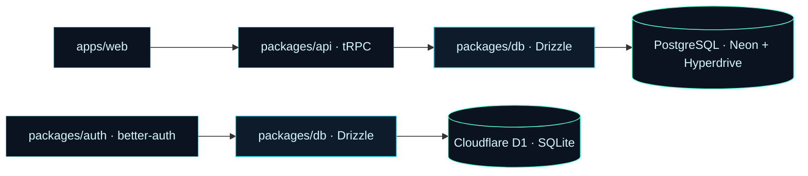
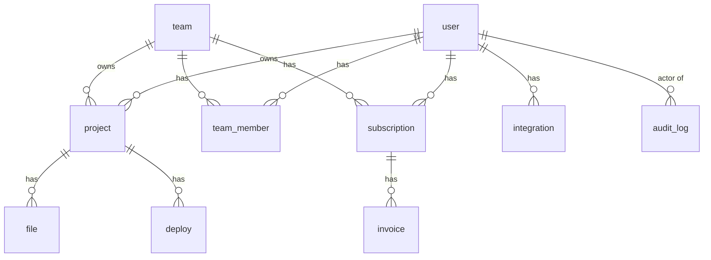

# 05 — Database

> Libra uses a dual-database setup. Business data lives in PostgreSQL (Neon + Hyperdrive connection pooling). Auth data lives in Cloudflare D1 (SQLite). Drizzle ORM 0.44.x is the only data access layer; all schemas are defined in TypeScript and migrations are generated via Drizzle Kit.

## Overview



## PostgreSQL schema (business data)

Defined in `packages/db/src/schema/`. All tables use `uuid` primary keys (`gen_random_uuid()` or `crypto.randomUUID()`), `createdAt` / `updatedAt` timestamps (`timestamp with time zone`), and follow snake_case column naming in SQL, camelCase in TypeScript.

### `user`

Business-side user record. Linked to `auth.user` (D1) by id.

| Column | Type | Notes |
|---|---|---|
| `id` | uuid | PK, matches D1 user id |
| `email` | text | unique, indexed |
| `name` | text | nullable |
| `avatar_url` | text | nullable |
| `role` | enum('user','admin') | default 'user' |
| `suspended` | boolean | default false |
| `suspended_reason` | text | nullable |
| `stripe_customer_id` | text | nullable, unique |
| `created_at` | timestamptz | default now() |
| `updated_at` | timestamptz | default now() |

### `project`

| Column | Type | Notes |
|---|---|---|
| `id` | uuid | PK |
| `name` | text | |
| `description` | text | nullable |
| `template` | text | nullable, default 'vite-shadcn' |
| `owner_id` | uuid | FK → user.id |
| `team_id` | uuid | FK → team.id, nullable (personal project if null) |
| `visibility` | enum('private','team','public') | default 'private' |
| `created_at` | timestamptz | |
| `updated_at` | timestamptz | |

### `file`

Project file tree.

| Column | Type | Notes |
|---|---|---|
| `id` | uuid | PK |
| `project_id` | uuid | FK → project.id, indexed |
| `path` | text | e.g. `src/components/Button.tsx` |
| `content` | text | full file source |
| `language` | text | e.g. `typescript`, `tsx` |
| `created_at` | timestamptz | |
| `updated_at` | timestamptz | |

Unique index on `(project_id, path)`.

### `deploy`

| Column | Type | Notes |
|---|---|---|
| `id` | uuid | PK |
| `project_id` | uuid | FK → project.id, indexed |
| `env` | enum('preview','production') | default 'preview' |
| `status` | enum('queued','building','deploying','live','failed','cancelled') | |
| `url` | text | nullable, populated when live |
| `artifact_url` | text | R2 location |
| `logs` | jsonb | `[{ts, level, message}]` |
| `started_at` | timestamptz | nullable |
| `finished_at` | timestamptz | nullable |
| `created_at` | timestamptz | |

### `team`

| Column | Type | Notes |
|---|---|---|
| `id` | uuid | PK |
| `name` | text | |
| `slug` | text | unique |
| `owner_id` | uuid | FK → user.id |
| `plan` | enum('free','pro','team') | default 'free' |
| `created_at` | timestamptz | |

### `team_member`

| Column | Type | Notes |
|---|---|---|
| `team_id` | uuid | FK → team.id, PK (composite) |
| `user_id` | uuid | FK → user.id, PK (composite) |
| `role` | enum('member','admin','owner') | default 'member' |
| `joined_at` | timestamptz | default now() |

### `subscription`

| Column | Type | Notes |
|---|---|---|
| `id` | uuid | PK |
| `team_id` | uuid | FK → team.id, nullable (personal sub if null) |
| `user_id` | uuid | FK → user.id, nullable |
| `stripe_subscription_id` | text | unique |
| `plan` | enum('free','pro','team') | |
| `status` | enum('active','past_due','canceled','incomplete') | |
| `current_period_start` | timestamptz | |
| `current_period_end` | timestamptz | |
| `cancel_at_period_end` | boolean | default false |
| `created_at` | timestamptz | |
| `updated_at` | timestamptz | |

### `invoice`

| Column | Type | Notes |
|---|---|---|
| `id` | uuid | PK |
| `subscription_id` | uuid | FK → subscription.id |
| `stripe_invoice_id` | text | unique |
| `amount_due` | integer | cents |
| `amount_paid` | integer | cents |
| `currency` | text | default 'usd' |
| `status` | enum('draft','open','paid','void','uncollectible') | |
| `hosted_invoice_url` | text | nullable |
| `created_at` | timestamptz | |

### `integration`

| Column | Type | Notes |
|---|---|---|
| `id` | uuid | PK |
| `user_id` | uuid | FK → user.id |
| `provider` | enum('github','gitlab','vercel','netlify') | |
| `config` | jsonb | provider-specific |
| `created_at` | timestamptz | |

Unique on `(user_id, provider)`.

### `audit_log`

| Column | Type | Notes |
|---|---|---|
| `id` | uuid | PK |
| `actor_id` | uuid | nullable (system events) |
| `action` | text | e.g. `project.delete` |
| `target_type` | text | e.g. `project` |
| `target_id` | uuid | nullable |
| `metadata` | jsonb | |
| `ip` | text | nullable |
| `user_agent` | text | nullable |
| `created_at` | timestamptz | default now(), indexed desc |

## D1 schema (auth data)

Defined in `packages/auth/src/schema/`. Managed by `better-auth` migrations + Drizzle Kit.

### `user`

| Column | Type | Notes |
|---|---|---|
| `id` | text | PK (UUID v4) |
| `email` | text | unique, indexed |
| `email_verified` | integer | 0/1 boolean |
| `name` | text | nullable |
| `image` | text | nullable |
| `created_at` | integer | unix epoch ms |
| `updated_at` | integer | unix epoch ms |

### `session`

| Column | Type | Notes |
|---|---|---|
| `id` | text | PK |
| `user_id` | text | FK → user.id, indexed |
| `token` | text | unique, indexed |
| `expires_at` | integer | unix epoch ms |
| `ip_address` | text | nullable |
| `user_agent` | text | nullable |
| `created_at` | integer | |
| `updated_at` | integer | |

### `account` (OAuth linkage)

| Column | Type | Notes |
|---|---|---|
| `id` | text | PK |
| `user_id` | text | FK → user.id |
| `account_id` | text | provider-side id |
| `provider_id` | text | e.g. `github` |
| `access_token` | text | encrypted at rest |
| `refresh_token` | text | encrypted at rest, nullable |
| `expires_at` | integer | nullable |
| `password` | text | hashed, nullable (email OTP users have null) |
| `created_at` | integer | |
| `updated_at` | integer | |

### `verification` (OTP / email tokens)

| Column | Type | Notes |
|---|---|---|
| `id` | text | PK |
| `identifier` | text | email or other identifier |
| `value` | text | the OTP / token |
| `expires_at` | integer | |
| `created_at` | integer | |
| `updated_at` | integer | |

## Migrations

### Generate

```bash
# PostgreSQL
cd packages/db
bun db:generate

# D1
cd packages/auth
bun db:generate
```

### Apply (local)

```bash
# PostgreSQL
cd packages/db
bun db:migrate

# D1
cd apps/web
bun wrangler d1 execute libra --local --file=./migrations/<file>.sql
```

### Apply (remote)

```bash
# D1 production
cd apps/web
bun wrangler d1 execute libra --remote --file=./migrations/<file>.sql
```

PostgreSQL migrations run via the standard Drizzle Kit pipeline; production runs through a managed migration job (Phase 7).

## Relationships diagram



## Indexes

Listed by table — every FK gets an index; every column used in WHERE / ORDER BY gets an index.

- `user(email)`, `user(stripe_customer_id)`
- `project(owner_id)`, `project(team_id)`, `project(updated_at desc)`
- `file(project_id, path)` unique
- `deploy(project_id)`, `deploy(status)`, `deploy(created_at desc)`
- `team(slug)` unique
- `team_member(user_id)`
- `subscription(stripe_subscription_id)` unique, `subscription(user_id)`, `subscription(team_id)`
- `invoice(stripe_invoice_id)` unique, `invoice(subscription_id, created_at desc)`
- `integration(user_id, provider)` unique
- `audit_log(created_at desc)`, `audit_log(actor_id)`
- D1: `session(token)` unique, `session(user_id)`, `account(user_id, provider_id)` unique

## Connection management

- PostgreSQL: connection string in `DATABASE_URL`, pooled via Cloudflare Hyperdrive. Pool size configured per-environment.
- D1: native binding via `wrangler.toml`, no pooling needed (serverless SQLite).

## Backups

- Neon PostgreSQL: automated daily backups, 7-day retention, point-in-time restore.
- D1: Wrangler `d1 export` to R2 nightly; 30-day retention.
